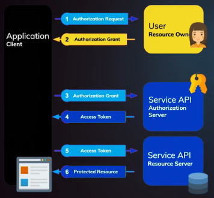

# Curso de Autenticación con Passport.js

## Tabla de Contenido
- [Stack de seguridad moderno](#Stack-de-seguridad-moderno)
- [¿Qué es la autenticación y la autorización?](#¿Qué-es-la-autenticación-y-la-autorización?)
- [Sesiones](#Sesiones)
- [JSON Web Tokens](#JSON-Web-Tokens)
  - [Anatomía de un JWT](#Anatomía-de-un-JWT)
  - [Utenticación tradicional vs JWT](#Utenticación-tradicional-vs-JWT)
  - [Firmando y Verificando nuestro JWT](#Firmando-y-Verificando-nuestro-JWT)
  - [Buenas practicas con JSON Web token](#Buenas-practicas-con-JSON-Web-token)

## Stack de seguridad moderno

- **JSON Web Tokens**: Nos permite comunicarnos entre dos clientes de una manera más segura.
- **OAuth 2.0**: Un estándar de la industria que permite implementar autorización.
- **OpenID Connect**: Es una capa de autenticación que funciona por encima de *OAuth 2.0*.

## ¿Qué es la autenticación y la autorización?

**La autenticación** sirve para verificar la identidad de un usuario, verificamos si el usuario existe y si los datos que está colocando son correctos.

**La autorización** es la acción de permitir a un usuario el acceso limitado a nuestros recursos.

## Sesiones

Cuando visitamos un sito por primera vez se crea una sesión con los ajustes que se configuran, por ejemplo, en un sitio web de reservas de hotel, a medida que buscamos y ponemos preferencias de precios y demás, estas se irán guardando en dichas sesiones. Y luego estos datos se convertirán en un ID que será almacenado en una cookie en tú navegador.

## JSON Web Tokens

### Anatomía de un JWT

***JWT*** es un estándar de la industri que nos permite manejar demandas de información, entre dos clientes.

Un ***JWT*** está formado por 3 partes, generalmente separados por un punto, la primera parte siempre es el **header** este contara con dos atributos que son:
  - el tipo que siempre va a ser *JWT*
  - el algoritmo de encriptación de la firma(puede ser asincrono o sincrono).

**Nota:**
*Los algoritmos asíncronos usan dos llaves de encriptación una llave pública y una privada, donde la llave publica se usa para encriptar y la privada para desencriptar.*

*Los algoritmos síncronos se usa la misma llave para encriptar y desencriptar.*

*Ambos son seguros de usar pero los algoritmos asíncronos deben usarse donde hallan partes publicas donde puedan tenar acceso a esta llave, mientras que los algoritmos síncronos solo deben usarse en sistemas como en el backend.*

La segunda parte es el payload, es donde guardamos toda la información de nuestro usuario incluso todos los scopes de autorización, ese payload se compone de algo llamado los Claims, estos están representados por tres letras, hay tres tipos de Claims que son:

- **registered claims**:Son Claims específicos que ya tiene una definición propia y deben respetarse.
- **public claims**:Son una lista de Claims que pueden usarse entre deferentes aplicaciones y ya están también definidos.
- **private claims**:Son claims que tu defines para tu aplicación.

La tercera parte del JWT que es la **firma** es lo que hace muy poderoso el **JWT**, está compuesto del header codificado más el payload codificado, todo esto se le aplica el algoritmo de encriptación por supuesto usando un **secret** , en el caso del algoritmo **HS256** debemos usar en string de 256 bit de longitud.


### Utenticación tradicional vs JWT

Cuando usamos una autenticación tradicional se crea una sesión y el ID de esa sesión se almacena en una cookie del navegador, pero cuando utilizamos JWT firmamos un token y este se guarda en el navegador el cual permite a una SPA actualizarse sin refrescar la ventana.

### Firmando y Verificando nuestro JWT

Para firmar nuestro token utilizaremos un paquete de node llamado **jsonwebtoken** y al usarlo en nuestro código se verá de esta manera:

```
jwt.sign({ sub: user.id }, 'secret', options);
```

El primer atributo que recibe es el **payload** o sea los datos que guardaremos en ese token. De segundo atributo recibe una clave secreta con la cual será firmado y finalmente podremos pasarle opciones si es nuestro caso.

Para verificar nuestro token lo haremos de la siguiente manera:

```
jwt.verify(token, 'secret', function(err, decoded){});
```

Como primer atributo recibiremos el token, de segundo atributo el secreto de la firma y como tercer argumento (opcional) recibiremos el token decodificado.


### Buenas practicas con JSON Web token

En los últimos años se ha criticado fuertemente el uso de JSON Web Tokens como buena practica de seguridad. La realidad es que muchas compañías hoy en día los usan sin ningún problema siguiendo unas buenas practicas de seguridad, que aseguran su uso sin ningún inconveniente.

A continuación listaremos unos consejos que se deben tener en cuenta:

#### Evitar almacenar información sensible

Debido a que los JSON Web tokens son decodificables es posible visualizar la información del payload, por lo que ningún tipo de información sensible debe ser expuesto como contraseñas, keys, etc. Tampoco debería agregarse información confidencial del usuario como su numero de identificación o información medica, ya que como hablamos anteriormente, los hackers pueden usar esta información para hacer ingeniería social.

#### Mantener su peso lo más liviano posible

Suele tenerse la tentación de guardar toda la información del perfil en el payload del JWT, pero esto no debería hacerse ya que necesitamos que el JWT sea lo más pequeño posible debido a que al enviarse con todos los request estamos consumiendo parte del ancho de banda.

#### Establecer un tiempo de expiración corto

Debido a que los tokens pueden ser robados si no se toman las medidas correctas de almacenamiento seguro, es muy importante que estos tengan unas expiración corta, el tiempo recomendado es desde 15 minutos hasta un maximo de 2 horas.

#### Tratar los JWT como tokens opacos

Aunque los tokens se pueden decodificar, deben tratarse como tokens opacos, es decir como si no tuviesen ningún valor legible. Esto es porque desde el lado del cliente no tenemos manera de verificar si la firma es correcta, así que si confiamos en la información decodificada del token, alguien podría introducir un token invalido con otra información a propósito. Lo mejor, es siempre enviar el token del lado del servidor y hacer las verificaciones allí.

##### ¿Donde guardar los tokens?
Cuando estamos trabajando con SPA (Single Page apps) debemos evitar almacenar los tokens en Local Storage o Session Storage. Estos deben ser almacenados en memoria o en una Cookie, pero solo de manera segura y con el flag httpOnly, esto quiere decir que la cookie debe venir del lado del servidor con el token almacenado. Más información: https://auth0.com/docs/security/store-tokens#single-page-apps

#### Silent authenticacion vs Refresh tokens

Debido a que es riesgoso almacenar tokens del lado del cliente, no se deberian usar Refresh Tokens cuando se trabaja solo con una SPA. Lo que se debe implementar es Silent Authentication, para ello se debe seguir el siguiente flujo:

- La SPA obtiene un access token al hacer login o mediante cualquier flujo de OAuth.
- Cuando el token expira el API retornara un error 401.
- En este momento se debe detectar el error y hacer un request para obtener de nuevo un access token.
- Si nuestro backend server tiene una sesión valida (Se puede usar una cookie) entonces respondemos con un nuevo access token.

**Más información:**

https://auth0.com/docs/api-auth/tutorials/silent-authentication
https://auth0.com/docs/tokens/refresh-token/current

*Hay que tener en cuenta que para implementar Silent authentication y Refresh tokens, se require tener un tipo de sesión valida del lado del servidor por lo que en una SPA es posible que sea necesario una especie de backend-proxy, ya que la sesión no debería convivir en el lado del API server.*

*En el paso 2, si se esta usando alguna librería para manejo de estado como redux, se puede implementar un middleware que detecte este error y proceda con el paso 3.*

## Cookie

### ¿Que es una cookie?
Una cookie es un archivo creado por un sitio web que tiene pequeños pedazos de datos almacenados en el. Su propósito es identificar el usuario mediante el almacenamiento de su historial.

### Las cookies sesión
Las **cookies sesión** son cookies que tienen un corto periodo de vida ya que son removidas cuando el navegador o la pestaña se cierran.

### Las persistent cookies
Las persistent cookies se usan generalmente para guardar información de interés para el usuario.

### Las secure cookies
Las secure cookies almacenan datos de forma cifradas para que terceros no puedan tener acceso a ellas, se suelen usar en conexiones HTTPS.

**Hay leyes de cookies que debes seguir al pie de la letra:**

- Avisarle al usuario que estás haciendo uso de cookies en tu sitio para guardar información.

- Es necesario que el usuario de su consentimiento para manejar cookies en tu sitio.

## Cookies vs Session Storage vs Local Storage

**El Local Storage:** tiene un almacenamiento de máximo 5 MB, la información almacenada aquí no se va con cada request que hacemos al servidor, estó nos ayuda a reducir la información entre cliente y servidor, la información que esta almacenada en el local storage persiste aunque cerremos la ventana de nuestro navegador, estó quiere decir que cuando volvemos a nuestro navegador la información la vamos a encontrar ahí.

**El Session Storage:** es similar al Local Storage solo que la información está disponible por tab o por window, esto quiere decir que apenas cerremos un tab o un window la información deja de persistir al igual solo la información que almacenamos en cada tab está disponible en ese mismo tab.

**Las cookies:** solo tienen un almacenamiento de 4KB, lo interesante de las cookies es que si se les puede establecer un tiempo de expiración.

Una de las desventajas que tienen las cookies es que por cada petición que se haga al servidor sea de imagenes, html, etc.

Las cookies van adjuntas a la petición esto ocaciona un gran consumo de datos cada vez que se hacen las peticiones.

Finalmente una de sus ventajas es que las cookies se pueden hacer seguras mediante un flag llamado **htpp-only** eso permite que la información de la cookie solo sea accedida y modificada en el servidor.

##  ¿Cuando debemos usar el uno o el otro?

- Si la información no es sensible podemos almacenarla en **Local Storage** o en **Session Storage**.

- Si la información es medianamente sensible como por ejemplo: **nombres de usuario** o **algunos terminos que puedan identificar al usuario**, lo más recomendado es usar el **Session Storage**.

- Finalmente si la información es muy sensible como **contraseñas** o **JSON Web Tokens**, lo más recomendado es almacenarlo en una cookie pero siempre teniendo en cuenta el flag **http-only**.

## Passport.js

**Passport.js** es un **middleware** para **express** que nos permite implementar estrategias de autenticación de una manera rápida y simple.

## Configuración

Necesitamos instalar  Passport.js y las dependecias nesesarias para implementar nuestras estrategias.

```
npm i passport jsonwebtoken passport-http passport-jwt
```

Tambien vamos a instalar la libreria **chalk**, que nos permite pintar colores en la terminal.

```
npm i -D chalk
```

Debemos definir las variables de entorno necesarias para aplicar nuestras estrategias:

- Definimos las **password** **default** de nuestros usuarios
```
//USERS
DEFAULT_ADMIN_PASSWORD=
DEFAULT_USER_PASSWORD=
```
- Definimos cual va a ser nuestro **secret de JWT**, se recomienda usar la pagina [Keygen.io](https://keygen.io/#fakeLink)
```
//AUTH
AUTH_JTW_SECRET=
```

- Definimos nuestras **api keys** que van a ser generadas aleatoriamente
```
//API KEYS 
PUBLIC_API_KEY_TOKEN=
ADMIN_API_KEY_TOKEN=
```

### Implementacion de BasicStrategy

- Importamos las librerías:

```
const passport = require('passport');
const {BasicStrategy} = require('passport-http');
```

- Luego le creamos la instancia de nuestra **BasicStrategy** y se la pasamos el **middleware** de **passport**

```
passport.use( new BasicStrategy(async function(email, password, cb){
}))
```

Esta instancia recibirá como parámetros los valores a autenticar y un callback.

- **Ejemplo completo:**

```
const passport = require('passport');
const {BasicStrategy} = require('passport-http');

const boom = require('@hapi/boom');
const bcrypt = require('bcrypt');

const UserService = require('../../../services/users');

passport.use( new BasicStrategy(async function(email, password, cb){
  const userService = new UserService();
  try {
    const user = await userService.getUser({ email });

    if(!user){
      return cb(boom.unauthorized(), false);
    }

    let passwordValidation = await bcrypt.compare(password, user.password);
    if(!passwordValidation){
      return cb(boom.unauthorized(), false);
    }

    delete user.password;//importante

    return cb(null, user);
  } catch (error) {
    return cb(error)
  }
}))
```

***Notas:***

- ***1° Al momento de  retornar un error es una buena práctica no dar información detallada  sobre qué valor de autenticación es erróneo.***

- ***2° Si el usuario es autenticado correctamente es necesario eliminar el password para evitar huacos de seguridad.***

### Implementación de Strategy y Extract JWT con Passport.js


- Importamos las librerías:

```
const passport = require('passport');
const { Strategy, ExtractJwt } = require('passport-jwt');
```

**Nesecitamos el secret con que fue firmado nuestro JWT para que verifique que es complemente valido.**


- Luego le creamos la instancia de nuestra **Strategy** y se la pasamos el **middleware** de **passport**

Esta instancia recibe dos parámetros el primero es un objeto en el cual definimos el **secretOrKey** que es el **secret** con el cual firmamos el **jwt** y el **jwtFromRequest** el cual indica de donde vamos a obtener el **jwt**. Y como segundo parámetro recibe una función con la lógica de autenticación.

```
passport.use(
  new Strategy({
    secretOrKey: ,
    jwtFromRequest: 
  },
  await function(tokenPayload, cb){
    //lógica de autenticación.
  }
  )
)
```

Si usamos **ExtractJwt** podemos utilizar su función **fromAuthHeaderAsBearerToken** ell cual indica que vamos a obtener le **jwt** del **header** de la petición.

```
new Strategy({
    secretOrKey: ,
    jwtFromRequest: ExtractJwt.fromAuthHeaderAsBearerToken()
}, () => {})
```

La función con la lógica de autenticación recibe dos parámetros uno es el **payload** del **token** ya **decodificado** y el otro es un **callback**.

```
new Strategy({
    secretOrKey: ,
    jwtFromRequest: ExtractJwt.fromAuthHeaderAsBearerToken()
}, (tokenPayload, cb) => {})
```

- **Ejemplo completo:**

```
const passport = require('passport');
const { Strategy, ExtractJwt} = require('passport-jwt');

const boom = require('@hapi/boom');

const UserService = require('../../../services/users');
const { config } = require('../../../config');

passport.use(
  new Strategy({
    secretOrKey: config.authJtwSecret,
    jwtFromRequest: ExtractJwt.fromAuthHeaderAsBearerToken()
  },
  await function(tokenPayload, cb){
    const userService = new UserService();
    try {
      const user = await userService.getUser({ email: tokenPayload.email });

      if(!user){
        return cb(boom.unauthorized(), false)
      }

      delete user.passport;

      cb(null, {...user, scope: tokenPayload.scopes})
    } catch (error) {
      return cb(error)
    }
  }
  )
)
```

***Notas:***

- ***1° Si el usuario es autenticado correctamente es necesario eliminar el password para evitar huacos de seguridad.***

### Implementando nuestro Sign-in

- Importamos las librerías:

```
const passport = require('passport');
const jwt = require('jsonwebtoken');
```

- Importamos nuestra **BasicStrategy**

- verificamos que del cuerpo venga un atributo que se llame apiKeyToken este es el token que le vamos a pasar el Sign In para determinar que clase de permiso vamos a firmar en el JWT que vamos a devolver.

```
const { apiKeyToken } = req.body;

// verificamos si no existe el token
if(!apiKeyToken){
  next(boom.unauthorized('apiKeyToken is required'));
}
```

-  Cuando ya tengamos el token, podemos implementar un custom **Callback** se va ha encargar de ubicar a nuestro **usuario** en nuestro **request.user**, esto lo hacemos usando la funcionalidad **passport.authenticate**, esta función recibe dos parámetros el primero le indicamos que **estrategia** vamos a utilizar y como segundo parámetro una función **error frist** que recibe como parámetro el **error** y la **data** en el caso de este curso el **user**, en esta función vamos a tener todo la lógica de autenticación.

```
passport.authenticate('basic', function(error, user){
  try {
    if(error || !user){
      next(boom.unauthorized());
    }
        
  } catch (error) {
    next(error)
  }
})(req, res, next);
```

***Como es un custom Callback, debemos hace un Clousure con la firma de la ruta.***

- **Ejemplo completo:**

```
const express = require('express');
const passport = require('passport');
const boom = require('@hapi/boom');
const jwt = require('jsonwebtoken');

const ApiKeysService = require('../services/apiKeys');

const { config } = require('../config');

//Baisc
require('../utils/auth/strategies/basic');

function authApi(app){
  const router = express.Router();

  app.use('/api/auth', router);

  const apiKeysService  = new ApiKeysService();

  router.post('/sign-in', async (req, res, next) => {
    const { apiKeyToken } = req.body;

    if(!apiKeyToken){
      next(boom.unauthorized('apiKeyToken is required'));
    }

    passport.authenticate('basic', function(error, user){
      try {
        if(error || !user){
          next(boom.unauthorized());
        }

        req.login(user, {session: false}, async function(error){
          if(error){
            next(error)
          }

          const apiKey = await apiKeysService.getApiKey({ token: apiKeyToken })

          if(!apiKey){
            next(boom.unauthorized());
          }

          const { _id: id, name, email } = user;
          const payload = {
            sub: id,
            name,
            email,
            scopes: apiKey.scopes
          }

          const token = jwt.sign(payload, config.authJtwSecret, {
            expiresIn: '15m'
          })

          return res.status(200).json({ token, user: {id, name, email} })
        })
      } catch (error) {
        next(error)
      }
      // como es un custom Callback, debemos hace un Clousure con la firma de la ruta.
    })(req, res, next);
  })
}
```

### Protegiendo nuestras rutas con Passport.js

Para proteger nuestras rutas vamos a agegar el **middleware** **passport.authenticate** a cada una de nuestras rutas.

Es importante tener definida la estrategia de **JWT**.

```
const passport = require('passport');
require('strategies/jwt');

router.get(
    '/',
    passport.authenticate('jwt', { session: false }),
    () => {}
  );
```

## OAuth2.0 y OpenID Connect

### ¿Qué es OAuth 2.0 y OpenID Connect?

***OAuth 2.0*** es un estándar de la insdustria que nos permite implementar autorización.

**Flujo de OAuth 2.0**:
-	EL flujo comienza cuando la aplicación quiere hacer un Authorization Request
-	Entonces tu como usuario debes permitirle a la aplicación acceder a tus recursos esto lo haces a través de un Authorization Grant.
-	La aplicación con este Authorization Grant va al Authorization Server y verifica si estos datos son correctos.
-	De ser correctos los datos este nos devolverá un Access Token este podría ser un Token cualquiera o un JWT.
-	A partir de aquí la aplicación puede hacer cualquier petición al Resource Server.



**OpenID Connect** es una capa de autenticación que funciona sobre OAuth cón métodos ya construidos.

## Autentición con Google

### Cómo crear un proyecto en Google API para hacer autenticación con 0Auth 2.0

Con el fin de poder usar Google como método de autenticación es necesario crear un nuevo proyecto dentro de la consola de desarrolladores de Google.

- Nos dirigimos a [console.developers.google](https://console.developers.google.com) y nos autenticamos con nuestra cuenta de Google.

- En la parte superior izquierda seleccionamos la organización que queremos usar (Debe haber una por defecto) y hacemos click en ***Create Project***.

- Luego nos vamos al sidebar izquierdo y seleccionamos ***Credentials > Create credentials > OAuth client ID***.

- Nos aseguramos de elegir *Web Application* como el tipo de aplicación.

- Luego establecemos el nombre del cliente que en nuestro caso será *SSR Server*, el ***Authorized JavaScript origins***: *http://localhost:8000* y el ***Authorized redirect URIs*** *http://localhost:8000/auth/google-oauth/callback*. Cuando hagamos despliegue de nuestra aplicación lo ideal es crear otro cliente y remplazar las **URLs** por las **URLs** correspondientes de producción.

- El ***Application Name*** del ***Consent Screen*** será *Platzi Videos*.

- Al finalizar la creación copiamos el ***Client ID*** y ***Client secret*** que seran usados como *GOOGLE_CLIENT_ID* y *GOOGLE_CLIENT_SECRET* respectivamente.

## Autentición con Twitter

### Cómo crear una cuenta de desarrollador con Twitter

Con el fin de poder usar Twitter como método de autenticación es necesario crear una cuenta de desarrollador de Twitter. Es necesario postularse para que la cuenta de desarrollador pueda ser utilizada y suele tomar hasta 24 horas de aprobación.

Para aplicar a la cuenta es necesario hacer dirigirse a [developer.twitter.com](https://developer.twitter.com/en/apply-for-access.html) y hacer click en el botón *Apply for a developer account*.

Cuando la cuenta ha sido aprobada, entonces procederemos a crear una aplicación para usarla en nuestro método de autenticación, para ellos debemos:

- Nos dirigimos a la lista de nuestras aplicaciones en https://developer.twitter.com/en/apps

- Allí creamos una nueva app haciendo click en el botón Create an app.

- Llenamos los correspondientes campos como **App Name** y **Website URL**.

- Las URLs de **Terms of Service URL y Privacy policy** URL son necesarias para poder solicitar el email del usuario.

- Como callback URL podemos usar http://localhost:8000/auth/twitter/callback. Lo ideal es que cuando salimos a producción creamos una aplicación diferente y esta vez usaremos la URL de producción.

- Marcamos como **Enabled** que nuestra app va a ser usada para **Sign in with Twitter**.

- Hacemos click en **Create**, accedemos a los detalles de la app creada y en el tab de **Permissions**, y luego en **Additional permissions** marcamos **Request email address from users** y guardamos.

- Nos vamos al tab de Keys and tokens y copiamos los Consumer API Keys que son los que usaremos como *TWITTER_CONSUMER_KEY* y *TWITTER_CONSUMER_SECRET* respectivamente.
