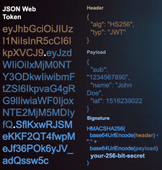

# Curso de Autenticación con Passport.js

## Tabla de Contenido
- [Stack de seguridad moderno](#Stack-de-seguridad-moderno)
- [¿Qué es la autenticación y la autorización?](#¿Qué-es-la-autenticación-y-la-autorización?)
- [Sesiones](#Sesiones)
- [JSON Web Tokens](#JSON-Web-Tokens)
  - [Anatomía de un JWT](#Anatomía-de-un-JWT)

## Stack de seguridad moderno

- **JSON Web Tokens**: Nos permite comunicarnos entre dos clientes de una manera más segura.
- **OAuth 2.0**: Un estándar de la industria que permite implementar autorización.
- **OpenID Connect**: Es una capa de autenticación que funciona por encima de *OAuth 2.0*.

## ¿Qué es la autenticación y la autorización?

**La autenticación** sirve para verificar la identidad de un usuario, verificamos si el usuario existe y si los datos que está colocando son correctos.

**La autorización** es la acción de permitir a un usuario el acceso limitado a nuestros recursos.

## Sesiones

Cuando visitamos un sito por primera vez se crea una sesión con los ajustes que se configuran, por ejemplo, en un sitio web de reservas de hotel, a medida que buscamos y ponemos preferencias de precios y demás, estas se irán guardando en dichas sesiones. Y luego estos datos se convertirán en un ID que será almacenado en una cookie en tú navegador.

## JSON Web Tokens

### Anatomía de un JWT

***JWT*** es un estándar de la industri que nos permite manejar demandas de información, entre dos clientes.

Un ***JWT*** está formado por 3 partes, generalmente separados por un punto, la primera parte siempre es el **header** este contara con dos atributos que son:
  - el tipo que siempre va a ser *JWT*
  - el algoritmo de encriptación de la firma(puede ser asincrono o sincrono).

**Nota:**
*Los algoritmos asíncronos usan dos llaves de encriptación una llave pública y una privada, donde la llave publica se usa para encriptar y la privada para desencriptar.*

*Los algoritmos síncronos se usa la misma llave para encriptar y desencriptar.*

*Ambos son seguros de usar pero los algoritmos asíncronos deben usarse donde hallan partes publicas donde puedan tenar acceso a esta llave, mientras que los algoritmos síncronos solo deben usarse en sistemas como en el backend.*

La segunda parte es el payload, es donde guardamos toda la información de nuestro usuario incluso todos los scopes de autorización, ese payload se compone de algo llamado los Claims, estos están representados por tres letras, hay tres tipos de Claims que son:

- **registered claims**:Son Claims específicos que ya tiene una definición propia y deben respetarse.
- **public claims**:Son una lista de Claims que pueden usarse entre deferentes aplicaciones y ya están también definidos.
- **private claims**:Son claims que tu defines para tu aplicación.

La tercera parte del JWT que es la **firma** es lo que hace muy poderoso el **JWT**, está compuesto del header codificado más el payload codificado, todo esto se le aplica el algoritmo de encriptación por supuesto usando un **secret** , en el caso del algoritmo **HS256** debemos usar en string de 256 bit de longitud.



### Utenticación tradicional vs JWT

Cuando usamos una autenticación tradicional se crea una sesión y el ID de esa sesión se almacena en una cookie del navegador, pero cuando utilizamos JWT firmamos un token y este se guarda en el navegador el cual permite a una SPA actualizarse sin refrescar la ventana.

### Firmando y Verificando nuestro JWT

Para firmar nuestro token utilizaremos un paquete de node llamado **jsonwebtoken** y al usarlo en nuestro código se verá de esta manera:

```
jwt.sign({ sub: user.id }, 'secret', options);
```

El primer atributo que recibe es el **payload** o sea los datos que guardaremos en ese token. De segundo atributo recibe una clave secreta con la cual será firmado y finalmente podremos pasarle opciones si es nuestro caso.

Para verificar nuestro token lo haremos de la siguiente manera:

```
jwt.verify(token, 'secret', function(err, decoded){});
```

Como primer atributo recibiremos el token, de segundo atributo el secreto de la firma y como tercer argumento (opcional) recibiremos el token decodificado.